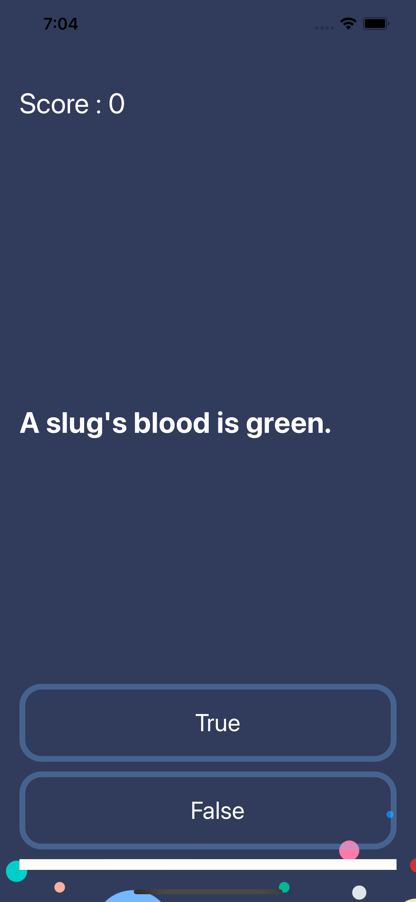
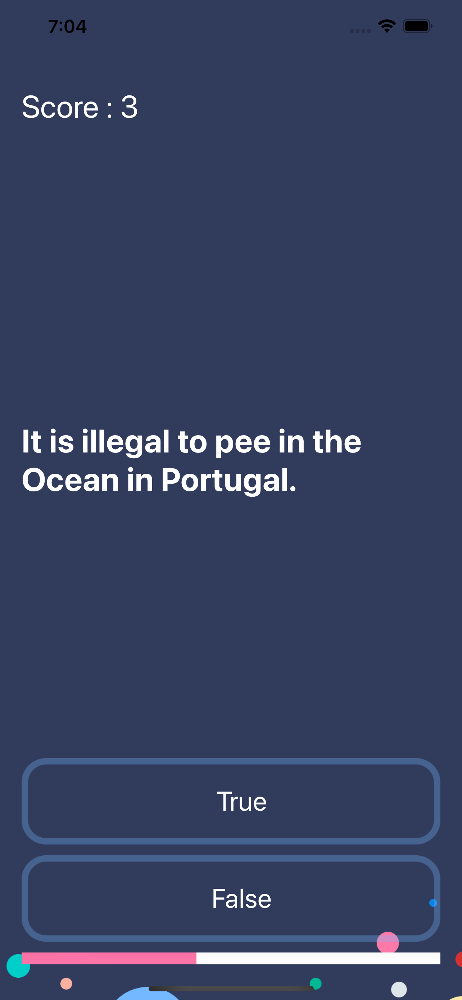
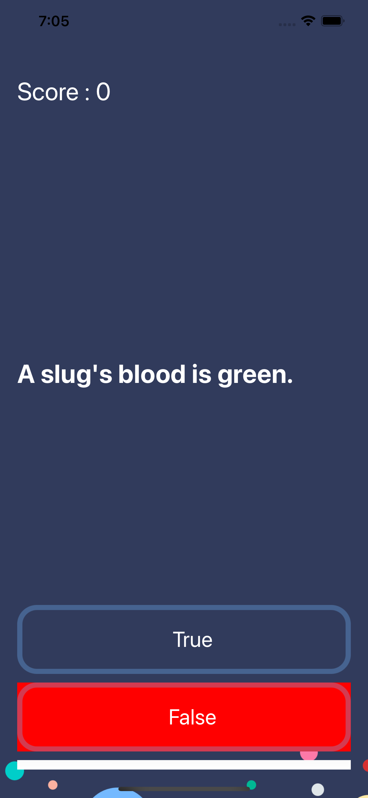
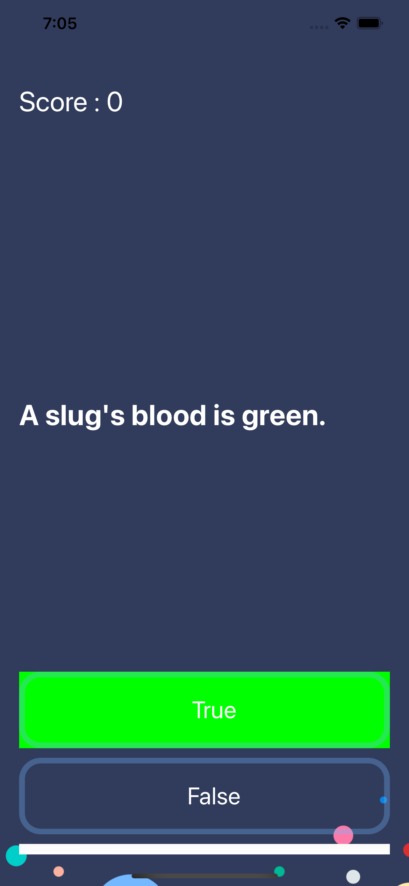

## Quizler :tada: :rocket:
Simple quiz iOS app made using Swift 

The idea is very simple the user can select the answers to the question , this app was created when learning about MVC pattern in iOS 
The app is made as a coursework , to demonstrate the implementation of the MVC architecture .

## App UI
**App Screens** 

Made with ❤️  using **SWIFT**
